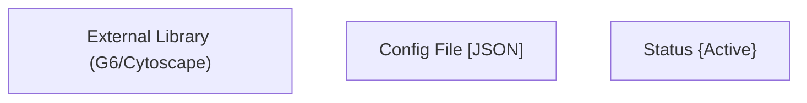
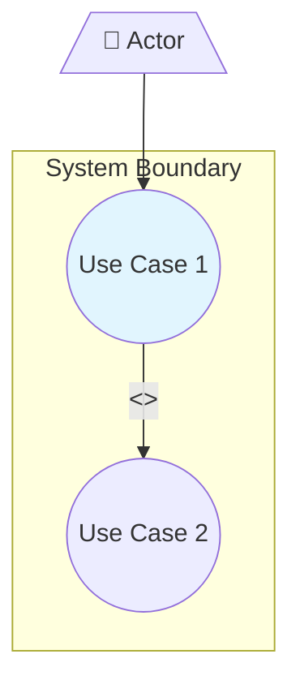
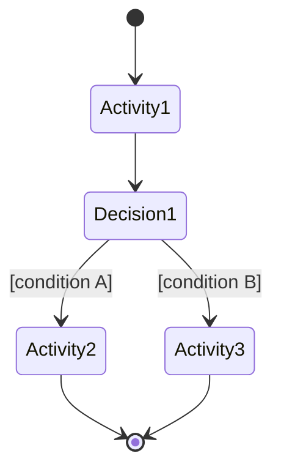
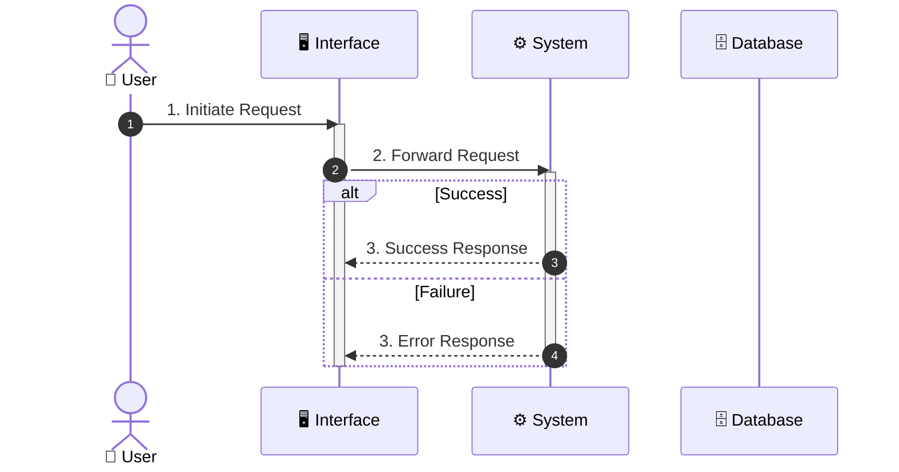

# Diagram and Documentation Standards

## Expression Priority

Always follow this priority when expressing requirements:

1. **UML Diagram (Mermaid)** — default choice, always use first
2. **Other Diagrams (Mermaid)** — when UML type not applicable
3. **Table + Diagram** — supplementary details only
4. **Text/Table only** — only when diagram is impossible

## UML Diagram Selection

| Requirement Type | UML Diagram | Mermaid Type |
|------------------|-------------|--------------|
| System interactions | Use Case Diagram | `graph TB` with actors |
| Process flow | Activity Diagram | `stateDiagram-v2` |
| Time-based interactions | Sequence Diagram | `sequenceDiagram` |
| Domain model | Class Diagram | `classDiagram` |
| Data model | ER Diagram | `erDiagram` |
| State transitions | State Diagram | `stateDiagram-v2` |
| Component structure | Component Diagram | `graph TB` with subgraphs |

For **user activity flows** and **business processes**, always use `stateDiagram-v2` (Activity Diagram), not `graph` (flowchart).

## Non-UML Diagrams

| Type | Purpose | Mermaid Type |
|------|---------|--------------|
| User Story Map | Release planning matrix | `graph TB` with subgraphs |
| Dependency Graph | Requirement relationships | `graph LR/TD` |
| Mind Map | Brainstorming | `mindmap` |
| Timeline | Milestones | `timeline` |

## Mermaid Syntax Constraints

Special characters in node text cause parse errors. Always wrap text containing `()[]{}/<>` in quotes:

Never write unquoted special characters in node labels — this will break rendering.

For line breaks in nodes, use ` ` inside quoted strings only.

## Use Case Diagram Standards

- Actors: stick figure icon `[/"👤 Name"\]`
- Use Cases: ellipse `((Use Case))`
- System Boundary: `subgraph`
- `<<include>>`: mandatory dependency
- `<<extend>>`: optional extension
- Never use simple flowcharts as substitutes for use case diagrams

## Activity Diagram Standards

Core user activity flows require UML Activity Diagrams. Tables alone are never sufficient.

## Sequence Diagram Standards

Use case main flows require Sequence Diagrams. Include all key participants: User, UI, System, Agent, Database, External Services. Use `par`, `alt`, `opt`, `loop`, `break` syntax as needed.

## Class Diagram vs ER Diagram

**Never mix their syntax.** Use `classDiagram` for OOP/domain modeling (supports methods, inheritance). Use `erDiagram` for database/data modeling (supports PK, FK, cardinality).

### Class Diagram relationships
| Relationship | Syntax |
|-------------|--------|
| Association | `A "1" -- "0..*" B : has` |
| Inheritance | `Parent <\|-- Child` |
| Composition | `A *-- B` |
| Aggregation | `A o-- B` |

### ER Diagram cardinality
| Syntax | Meaning |
|--------|---------|
| `\|\|--\|\|` | One to One |
| `\|\|--o{` | One to Many |
| `o{--o{` | Many to Many |

## Color Coding

- Primary elements: `fill:#e1f5fe` (light blue)
- Secondary elements: `fill:#f3e5f5` (light purple)
- Warning/attention: `fill:#fff3e0` (light orange)
- Success/completion: `fill:#e8f5e9` (light green)
- Error/critical: `fill:#ffebee` (light red)

## Diagram Decomposition

Split diagrams when they exceed 10 nodes, have more than 3 swimlanes, contain complex parallel flows, or span multiple abstraction levels. Use an overview diagram with detail sub-diagrams.

## Document Format

- Each analysis item on a separate line
- Key terms in **bold**
- Consistent indentation throughout
- Clear visual hierarchy with proper heading levels
