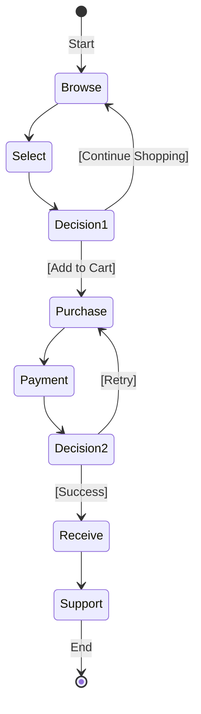
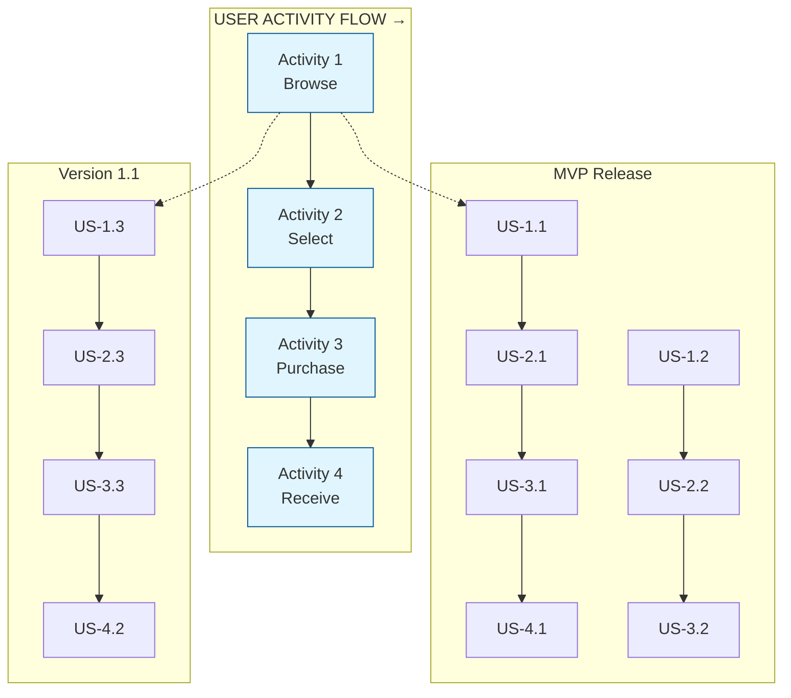
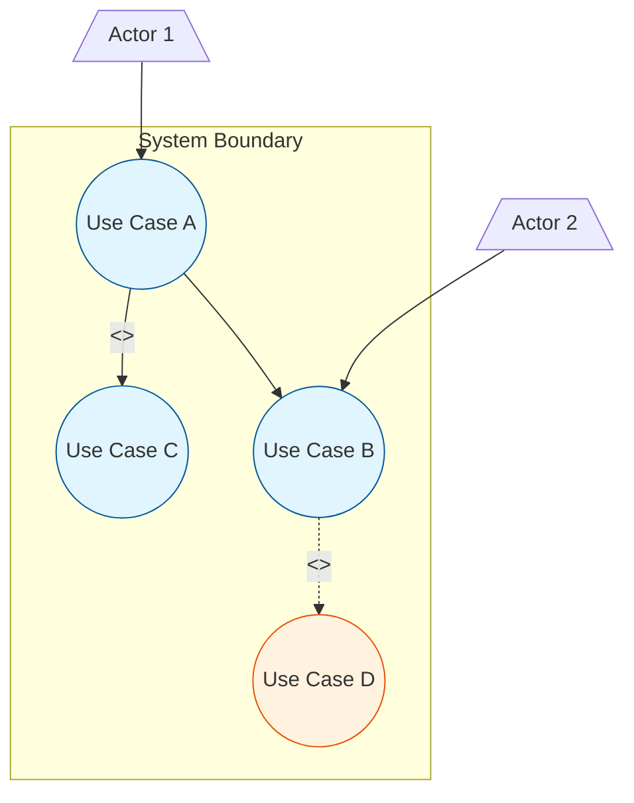
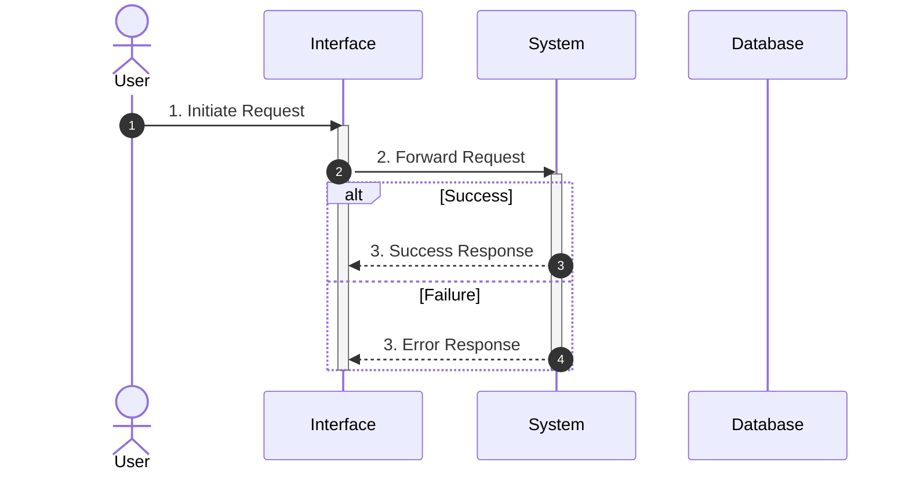
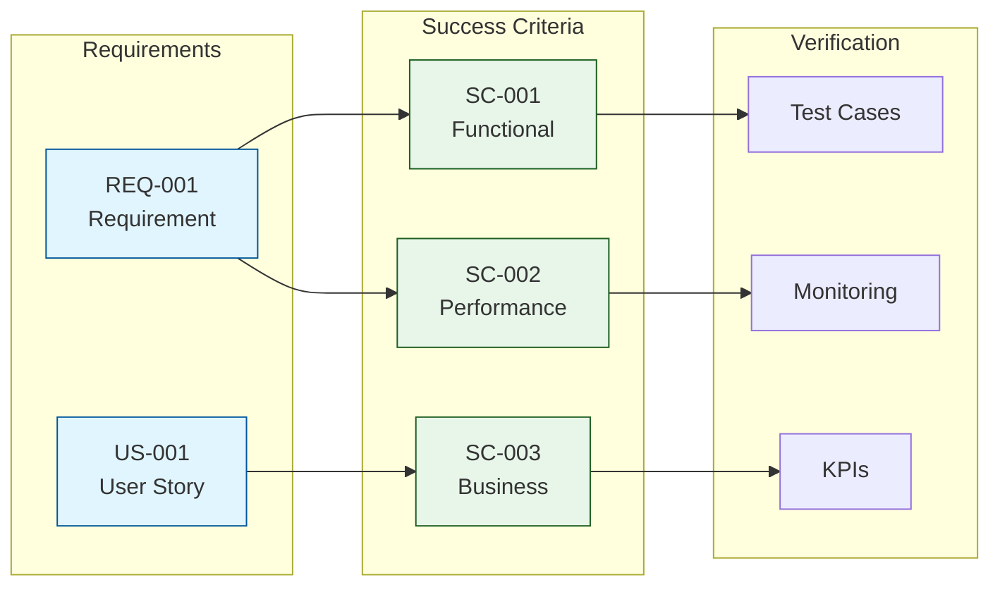
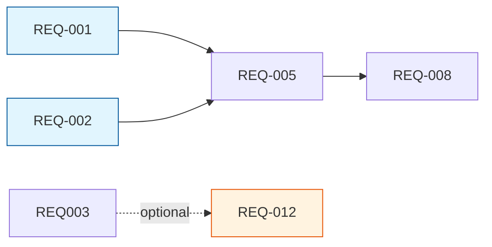
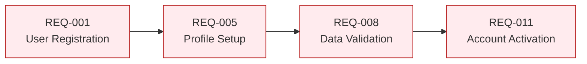
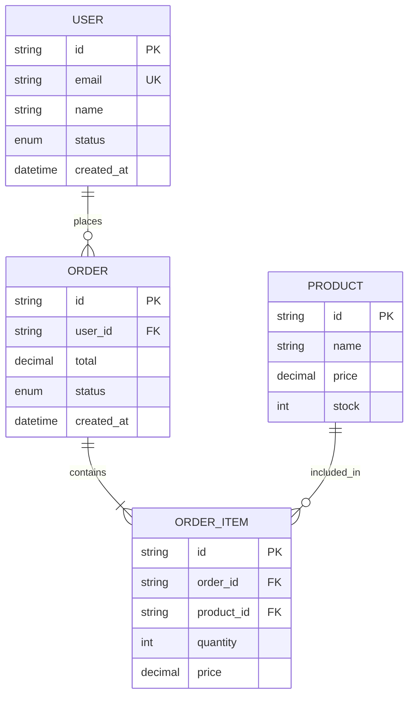
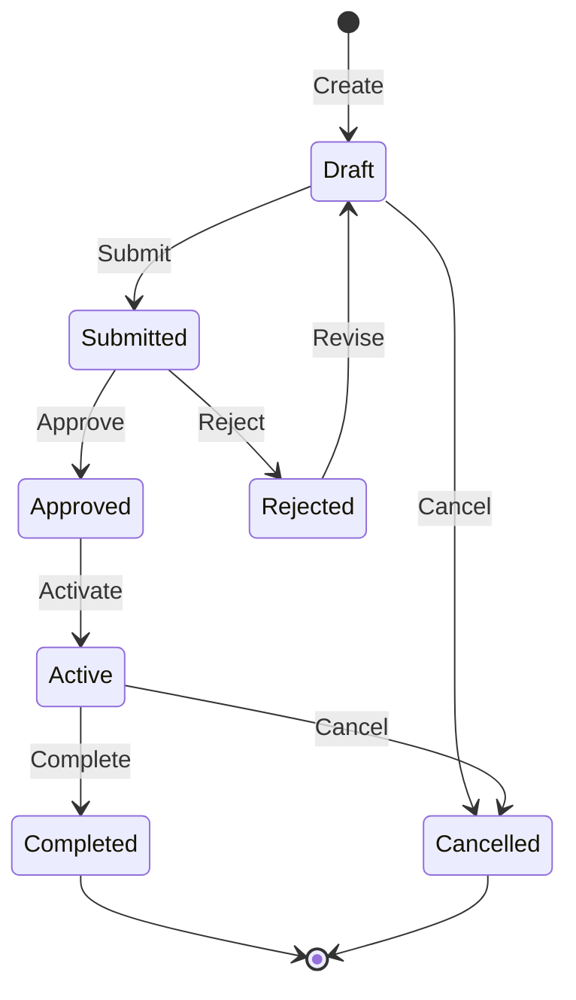
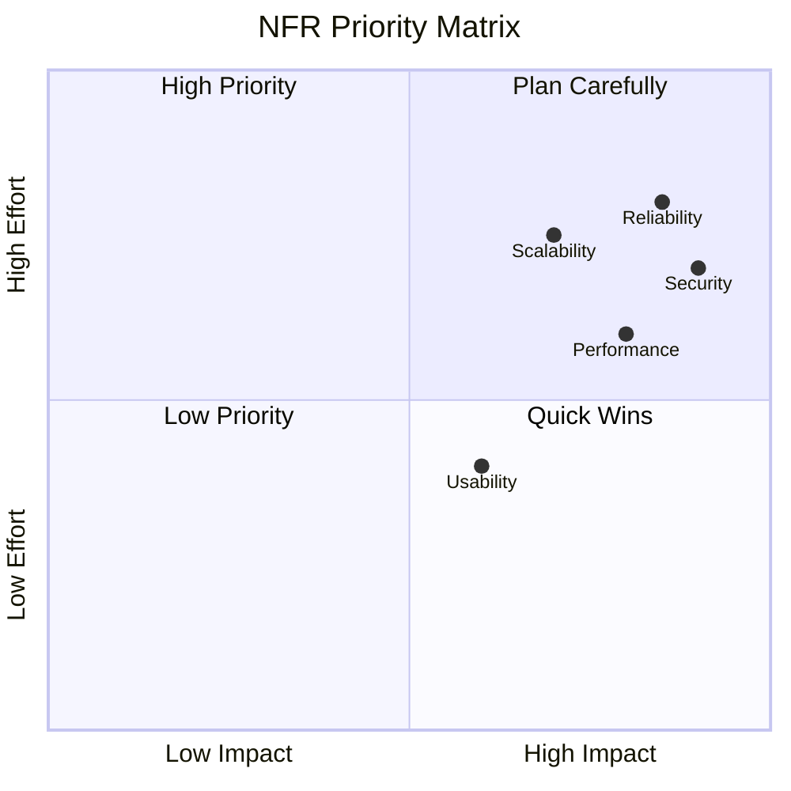

# Phase 3: Requirements Analysis

**Objective**: Deep analysis of dependencies, feasibility, and implementation approaches.
**Time Allocation**: 20% of total effort
**Role**: Professional Requirements Analyst

## Quick Reference

| Method | Focus | Output |
|--------|-------|--------|
| User Story Mapping | User activities and priorities | Story map with MVP |
| Use Case Analysis | Actor-system interactions | Use case documents |
| Success Criteria | Measurable outcomes | SMART criteria list |
| Event Storming | Domain events and commands | Domain model |
| Dependency Analysis | Requirement relationships | Dependency graph |
| Domain Data Modeling | Entities and relationships | data-model.md |
| NFR Analysis | System qualities | NFR specification |

## Output

**Files**:
- `specs/[feature-name]/requirements.md` — User stories, use cases, success criteria, dependencies
- `specs/[feature-name]/data-model.md` — Entity definitions, relationships, state diagrams

**Templates**: Read `references/template-analysis.md` and `references/template-data-model.md`
**Standards**: Follow `references/diagram-standards.md` for all diagrams.

## Pre-Check

- Phase 2 completed? `sort.md` exists with value sorting?
- Inputs available? Prioritization (MoSCoW/RICE) complete?
- If `clarification.md` or `validation.md` already exist, load and reference them (this is an iteration).

If any check fails: STOP and return to Phase 2.

## Iterative Analysis

If `clarification.md` exists: read it, extract resolved Q&A, apply to analysis, mark updates with `[Updated per Clarification Q1]`.

If `validation.md` exists: read it, extract issues by dimension, address each in the relevant section, mark with `[Updated per Validation V-001]`.

---

## Method 1: User Story Mapping

### Core User Activity Flow (UML Activity Diagram)

Use `stateDiagram-v2` for user activity flows:



**Activity Diagram Elements:**
| Element | UML Standard | Mermaid Syntax |
|---------|--------------|----------------|
| Start Node | Filled circle | `[*] -->` |
| End Node | Bull's eye | `--> [*]` |
| Activity | Rounded rectangle | `StateName: Label` |
| Decision | Diamond | `state Name <<choice>>` |
| Transition | Arrow with guard | `--> Target: [condition]` |
| Fork/Join | Thick bar | `state Name { ... }` |

### User Story Format

```
As a [role],
I want [feature/capability],
So that [business value/benefit].
```

Each story must pass INVEST: Independent, Negotiable, Valuable, Estimable, Small, Testable.

### Story Map Visualization

Use `graph TB` with subgraphs to create a matrix: Activities across the top (user flow), releases down (MVP → v1.1 → v2.0).



**Story Map Structure:**
| Row | Description | Priority |
|-----|-------------|----------|
| **Activities** | User journey steps (left to right) | - |
| **MVP** | Minimum stories to launch | P0 |
| **V1.1** | First enhancement release | P1 |
| **V2.0** | Future features | P2 |

---

## Method 2: Use Case Analysis

### Use Case Diagram

Draw use case diagrams with actors (stick figures), use cases (ellipses), system boundary (subgraph), and `<<include>>`/`<<extend>>` relationships.



**Diagram Elements:**
| Element | Mermaid Syntax | Description |
|---------|----------------|-------------|
| Actor | `[/"Name"\]` | Stick figure representation |
| Use Case | `((Name))` | Ellipse shape |
| System Boundary | `subgraph` | Dashed rectangle container |
| Include | `-->|<<include>>|` | Mandatory dependency |
| Extend | `-.->|<<extend>>|` | Optional extension |

### Use Case Document

For each use case, document: Basic Info, Preconditions, Postconditions, Main Flow (as Sequence Diagram), Alternative Flows, Exception Flows, Business Rules, and NFRs.

The main flow of every use case requires a Sequence Diagram — actor-system tables alone are insufficient.



---

## Method 3: Success Criteria

Define SMART criteria for each requirement:

| Attribute | Description |
|-----------|-------------|
| Specific | Clear and unambiguous |
| Measurable | Quantifiable metric |
| Achievable | Realistic given constraints |
| Relevant | Aligned with business goals |
| Time-bound | Has defined timeframe |

Categories: Functional, Performance, Usability, Business, Quality.

### Success Criteria Traceability



### Example Success Criteria

| SC ID | Requirement | Category | Metric | Target |
|-------|-------------|----------|--------|--------|
| SC-001 | US-001 Login | Functional | Login success rate | >= 99.5% |
| SC-002 | US-001 Login | Performance | Login response time | < 1 second |
| SC-003 | US-001 Login | Security | Failed login lockout | After 5 attempts |
| SC-004 | US-002 Search | Usability | Search result relevance | >= 90% accuracy |
| SC-005 | REQ-010 | Business | User retention | >= 80% after 30 days |

---

## Method 4: Event Storming (Complex Systems)

Identify Domain Events (orange), Commands (blue), Aggregates (yellow), Policies (purple), Read Models (green), External Systems (pink), Hot Spots (red/unresolved).

### Event Storming Output

```
[User] → [Command] → [Aggregate] → [Domain Event] → [Policy] → [Next Command]
```

| Element | Description | Example |
|---------|-------------|---------|
| Domain Event | Something that happened | "Order Placed" |
| Command | Action that triggers event | "Place Order" |
| Aggregate | Entity that receives command | "Order" |
| Policy | Reaction rule | "When order placed, notify warehouse" |
| Read Model | Data needed for decision | "Available inventory" |
| External System | Third-party integration | "Payment Gateway" |
| Hot Spot | Unresolved question | "How to handle split shipment?" |

---

## Method 5: Dependency Analysis

### Dependency Types

| Type | Description | Risk Level |
|------|-------------|------------|
| Mandatory | Must complete A before B | High |
| Optional | A enhances B | Low |
| Conflicting | A and B cannot coexist | Critical |
| External | Depends on outside system | High |

### Dependency Graph



### Critical Path



Map requirement dependencies: Mandatory, Optional, Conflicting, External. Identify the critical path and bottlenecks.

---

## Method 6: Domain Data Modeling

Create `data-model.md` with: ER Diagram (Mermaid), Entity Definitions (attributes, types, constraints), Relationships, State Diagrams for entity lifecycles, Validation Rules, Data Volume Estimates, and Glossary.

### ER Diagram Example



### State Diagram Example



---

## Method 7: NFR Analysis (FURPS+ Model)

| Category | Key Questions |
|----------|---------------|
| Performance | Response time? Throughput? Concurrent users? |
| Security | Auth? Encryption? Audit? |
| Reliability | Uptime SLA? Failover? Recovery? |
| Usability | WCAG? Learnability? Error handling? |
| Scalability | Horizontal/vertical? Data volume growth? |
| Maintainability | Logging? Monitoring? Deployment? |
| Compatibility | Browsers? Devices? Third-party? |

Each NFR must have: Category, Priority, Related FR, Measurable Target, and Verification Method.

### NFR by Category Examples

#### Performance

| NFR ID | Requirement | Metric | Target |
|--------|-------------|--------|--------|
| NFR-P01 | Page load time | Time to First Contentful Paint | < 1.5s |
| NFR-P02 | API response time | 95th percentile latency | < 200ms |
| NFR-P03 | Concurrent users | Simultaneous active sessions | >= 10,000 |
| NFR-P04 | Throughput | Transactions per second | >= 1,000 TPS |

#### Security

| NFR ID | Requirement | Metric | Target |
|--------|-------------|--------|--------|
| NFR-S01 | Authentication | Multi-factor authentication | Required for admin |
| NFR-S02 | Data encryption | Encryption at rest | AES-256 |
| NFR-S03 | Data encryption | Encryption in transit | TLS 1.3 |
| NFR-S04 | Session management | Session timeout | 30 min inactive |
| NFR-S05 | Audit logging | Security events logged | 100% coverage |

#### Reliability

| NFR ID | Requirement | Metric | Target |
|--------|-------------|--------|--------|
| NFR-R01 | Availability | Uptime SLA | 99.9% (8.76h downtime/year) |
| NFR-R02 | Disaster recovery | Recovery Time Objective (RTO) | < 4 hours |
| NFR-R03 | Data durability | Recovery Point Objective (RPO) | < 1 hour |
| NFR-R04 | Backup | Backup frequency | Daily full, hourly incremental |

#### Usability

| NFR ID | Requirement | Metric | Target |
|--------|-------------|--------|--------|
| NFR-U01 | Accessibility | WCAG compliance | Level AA |
| NFR-U02 | Learnability | Time to complete key task (new user) | < 5 min |
| NFR-U03 | Error recovery | User can recover from error | Without data loss |
| NFR-U04 | Localization | Supported languages | EN, ZH-CN |

#### Scalability

| NFR ID | Requirement | Metric | Target |
|--------|-------------|--------|--------|
| NFR-SC01 | Horizontal scaling | Auto-scale trigger | CPU > 70% |
| NFR-SC02 | Data growth | Storage capacity plan | 100GB/year growth |
| NFR-SC03 | User growth | Support user base | 1M users by Year 2 |

#### Maintainability

| NFR ID | Requirement | Metric | Target |
|--------|-------------|--------|--------|
| NFR-M01 | Logging | Log retention | 90 days |
| NFR-M02 | Monitoring | System health dashboard | Real-time |
| NFR-M03 | Deployment | Deployment frequency | On-demand, < 30min |
| NFR-M04 | Documentation | API documentation | 100% coverage |

#### Compatibility

| NFR ID | Requirement | Metric | Target |
|--------|-------------|--------|--------|
| NFR-C01 | Browser support | Supported browsers | Chrome, Firefox, Safari, Edge (latest 2) |
| NFR-C02 | Mobile support | Responsive design | iOS 14+, Android 10+ |
| NFR-C03 | API compatibility | API versioning | Backward compatible for 2 major versions |

### NFR Prioritization Matrix



---

## Exit Criteria

| Criteria | Standard |
|----------|----------|
| Diagram Standards | All diagrams follow UML/Mermaid standards |
| User Story Map | Core user journeys mapped |
| Use Case Diagrams | Main use cases with Sequence Diagrams |
| Success Criteria | SMART criteria for key requirements |
| Data Model | `data-model.md` with ER and state diagrams |
| NFR Analysis | All categories reviewed with measurable targets |
| Dependency Graph | Dependencies mapped, no circular |
| Feasibility | Technical risks evaluated |

## Next Step

Phase 4: Clarification — Systematic questioning to eliminate ambiguity.
