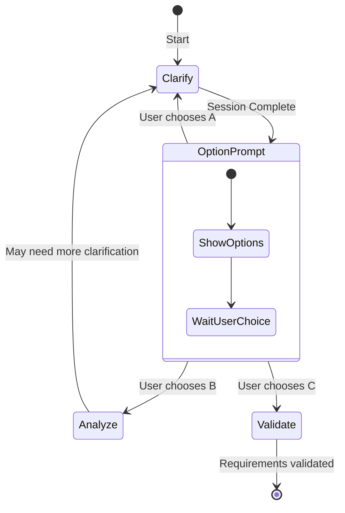

# Phase 4: Requirements Clarification

**Objective**: Eliminate ambiguity through targeted questioning and document all clarification decisions.
**Time Allocation**: 15% of total effort
**Role**: Professional Requirements Analyst

## Quick Reference

| Aspect | Guideline |
|--------|-----------|
| Goal | Clarify ALL critical ambiguities |
| Question Format | Multiple-choice (2-4 options) or Short phrase |
| Delivery | ONE question at a time, wait for answer |
| Output | `clarification.md` (log) + update Phase 3 outputs |

After each answer: immediately write Q&A to `clarification.md` AND update all affected Phase 3 files. Do not ask the next question until updates are done.

## Output

**File**: `specs/[feature-name]/clarification.md`
**Template**: Read `references/template-clarification.md`

## Pre-Check

- Phase 3 completed? `requirements.md` exists with user stories and use cases?
- Ambiguities identified? Requirements with `[NEEDS CLARIFICATION]` markers?
- Stakeholder available? User can answer questions?

If any check fails: STOP and return to Phase 3.

---

## Validation Failure Check

If `validation.md` exists, this is a re-clarification session. Load it, extract failed dimensions (score < 80%), list specific issues, and prioritize questions on validation failures.

### Validation-to-Clarification Mapping

| Failed Dimension | Clarification Focus |
|------------------|---------------------|
| Authenticity | Verify user needs, confirm stakeholder requirements |
| Completeness | Fill missing specs, clarify unclear parts |
| Consistency | Resolve conflicts, align terminology |
| Feasibility | Clarify scope, discuss constraints |
| Verifiability | Define acceptance criteria, quantify requirements |

### Re-Clarification Priority Order

1. Questions directly addressing validation failures (highest priority)
2. Questions about related requirements affected by failures
3. New ambiguities discovered during validation
4. Standard ambiguity taxonomy items

---

## Ambiguity Taxonomy

Scan for ambiguities across these categories:

### 1. Functional Scope & Behavior

| Check Point | Questions to Consider |
|-------------|----------------------|
| Core user goals | What defines success for the user? |
| Success criteria | How do we measure if the feature works? |
| Out-of-scope | What is explicitly NOT included? |
| User roles | Are all personas clearly differentiated? |

### 2. Domain & Data Model

| Check Point | Questions to Consider |
|-------------|----------------------|
| Entities & attributes | Are all data fields defined? |
| Identity & uniqueness | What makes each record unique? |
| Lifecycle/state | What states can entities transition through? |
| Data volume | What scale assumptions are we making? |

### 3. Interaction & UX Flow

| Check Point | Questions to Consider |
|-------------|----------------------|
| User journeys | Are critical paths fully documented? |
| Error states | What happens when things go wrong? |
| Empty states | What does the user see with no data? |
| Loading states | How is progress communicated? |

### 4. Non-Functional Quality Attributes

| Check Point | Questions to Consider |
|-------------|----------------------|
| Performance | Latency and throughput targets? |
| Scalability | Horizontal/vertical limits? |
| Reliability | Uptime and recovery requirements? |
| Security | Authentication and authorization rules? |
| Compliance | Regulatory constraints? |

### 5. Integration & External Dependencies

| Check Point | Questions to Consider |
|-------------|----------------------|
| External APIs | Which services? Failure modes? |
| Data formats | Import/export specifications? |
| Protocol versions | API versioning strategy? |

### 6. Edge Cases & Failure Handling

| Check Point | Questions to Consider |
|-------------|----------------------|
| Negative scenarios | What if user provides invalid input? |
| Rate limiting | How to handle abuse? |
| Concurrent edits | Conflict resolution strategy? |

### 7. Terminology & Consistency

| Check Point | Questions to Consider |
|-------------|----------------------|
| Glossary terms | Are key terms defined? |
| Synonyms | Are deprecated terms identified? |

---

## Execution Flow

### Step 1: Load and Scan

Read `requirements.md` and scan for: vague terms ("user-friendly", "fast"), missing details ("users can login" — which users? how?), unclear scope, undefined conditions, and `[TBD]`/`[NEEDS CLARIFICATION]` placeholders.

### Step 2: Generate Prioritized Questions

Priority order:
1. Functional scope ambiguities (blocking)
2. Data model ambiguities (architectural impact)
3. Non-functional requirements (quality impact)
4. Edge cases (robustness)
5. Terminology (consistency)

Each question must be: answerable (multiple-choice or <= 5 words), impactful, balanced across categories, and non-trivial.

### Step 3: Ask ONE Question at a Time

Present exactly one question per response. Wait for the answer before the next.

**Multiple-choice format:**
```
**Question [N/Total]**: [Category]

[Question text]

**Recommended**: Option [X] - [Brief reason]

**Options**:
> **A** - [Description]
> **B** - [Description]
> **C** - [Description]
> **Other** - Provide your own answer

Reply with option letter, "yes" to accept recommendation, or your custom answer.
```

**Short-answer format:**
```
**Question [N/Total]**: [Category]

[Question text]

**Suggested Answer**: [Your suggestion] - [Brief reason]

Enter your answer (<= 5 words), or "yes" to accept suggestion.
```

### Step 4: Record and Update (after EACH answer)

1. Append Q&A to `clarification.md`
2. Update ALL affected Phase 3 outputs
3. Remove `[NEEDS CLARIFICATION]` markers with resolved content
4. Add cross-reference to clarification log
5. Verify both files saved before next question

### Step 5: Stop Conditions

Stop when: all critical ambiguities resolved, user signals completion ("done", "enough"), or remaining ambiguities are non-blocking.

### Step 6: Per-Answer Validation

After EACH answer update, verify:
- [ ] Q&A recorded in `clarification.md`
- [ ] ALL affected Phase 3 outputs updated
- [ ] `[NEEDS CLARIFICATION]` markers removed
- [ ] No contradictory statements introduced
- [ ] Terminology consistent across all files

### Step 7: Completion Report

```markdown
## Clarification Complete

### Files Updated
| File | Path | Status |
|------|------|--------|
| Clarification Log | `specs/[feature-name]/clarification.md` | CREATED |
| Analysis | `specs/[feature-name]/requirements.md` | UPDATED |

### Session Summary
**Questions asked**: [N]
**Session date**: YYYY-MM-DD

### Coverage Summary
| Category | Status |
|----------|--------|
| Functional Scope | Resolved / Clear / Deferred |
| Domain & Data | Resolved / Clear / Deferred |
| Interaction & UX | Resolved / Clear / Deferred |
| Non-Functional | Resolved / Clear / Deferred |
| Integration | Resolved / Clear / Deferred |
| Edge Cases | Resolved / Clear / Deferred |
| Terminology | Resolved / Clear / Deferred |

**Status Legend**: Resolved (was ambiguous, now clarified), Clear (already sufficient), Deferred (non-blocking)
```

---

## Behavior Rules

- **No ambiguities found**: "No critical ambiguities detected. Recommend proceeding to Phase 5: Validate."
- **Analysis file missing**: "Please complete Phase 3: Analyze first."
- **Respect user signals**: Stop immediately if user says "done" or "enough"
- **Avoid speculation**: Don't ask about tech stack unless it blocks functional clarity

---

## Exit Criteria

| Criteria | Standard |
|----------|----------|
| Clarification Log | `clarification.md` created |
| All Q&A Recorded | Complete details for each question |
| Analysis Updated | Clarifications applied to `requirements.md` |
| No Contradictions | Consistent statements |
| Critical Ambiguities | All resolved |

## Next Steps (present to user)

| Option | Action | When to Choose |
|--------|--------|----------------|
| A | Clarify (Continue) | Deferred items need resolution |
| B | Analyze (Re-analyze) | Significant scope changes |
| C | Validate (Proceed) | All critical ambiguities resolved |

### Option Flows


