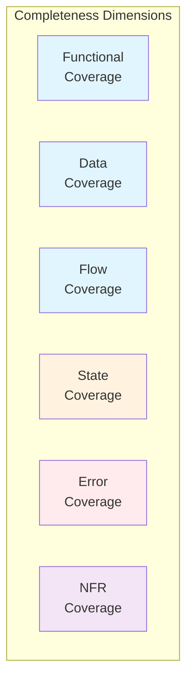
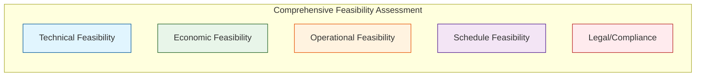
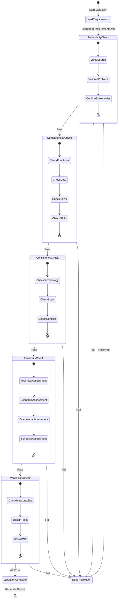
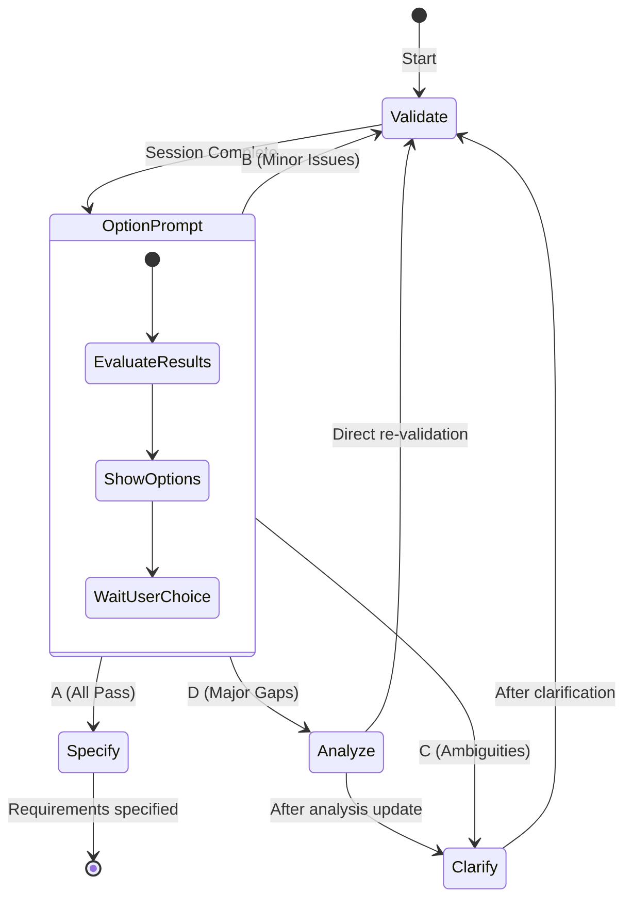

# Phase 5: Requirements Validation

**Objective**: Validate requirements through 5 critical dimensions to ensure readiness for implementation.
**Time Allocation**: 15% of total effort
**Role**: Professional Requirements Analyst

## The 5 Validation Dimensions

| Dimension | Focus | Key Question |
|-----------|-------|--------------|
| Authenticity | Real need | Is this a genuine user/business need? |
| Completeness | Coverage | Are all aspects fully specified? |
| Consistency | Coherence | Are requirements conflict-free? |
| Feasibility | Achievability | Is it technically and economically viable? |
| Verifiability | Testability | Can we objectively verify it's met? |

## Output

**File**: `specs/[feature-name]/validation.md`
**Template**: Read `references/template-validation.md`
**Helper**: Read `references/multi-role-validation.md` for 5-role validation perspectives.

## Pre-Check

- Phase 4 completed? `clarification.md` exists with resolved ambiguities?
- All requirements documented and clarified in `requirements.md`?
- Reviewers from different roles identified?

If any check fails: STOP and return to Phase 4.

## Multi-Role Validation

Requirements must be validated from 5 role perspectives (see `references/multi-role-validation.md`):
- **Product Manager (PM)**: Business value, user need, strategic alignment
- **Requirements Analyst (RA)**: Completeness, clarity, traceability
- **Software Architect (SA)**: Technical feasibility, architecture impact, NFRs
- **Software Engineer (SE)**: Implementation clarity, effort estimation, error handling
- **Test Engineer (TE)**: Testability, acceptance criteria, test coverage

---

## Dimension 1: Authenticity

Verify requirements represent genuine user needs, not assumptions.

**Check**: User origin, problem evidence, business alignment, stakeholder confirmation, usage frequency.

**Red Flags**:

| Red Flag | Description | Action |
|----------|-------------|--------|
| "Users might want..." | Assumption without evidence | Conduct user research |
| "Competitor has it" | Feature copying without validation | Validate with YOUR users |
| No stakeholder source | Origin unclear | Trace back to source |
| "Future-proofing" | Speculative requirement | Defer or validate need |

### Authenticity Checklist

- [ ] Requirement traced to specific user/stakeholder request
- [ ] Original request documented (interview, ticket, email)
- [ ] Not based solely on assumptions or competitor features
- [ ] Problem statement clearly articulated
- [ ] Evidence of problem exists (metrics, complaints, observations)
- [ ] Impact of NOT solving this problem quantified
- [ ] Business sponsor confirmed the need
- [ ] End users confirmed this solves their problem
- [ ] Clear business benefit articulated
- [ ] Aligned with product strategy/roadmap

---

## Dimension 2: Completeness

Ensure requirements are fully specified with no gaps.

### Completeness Model



### Completeness Checklist

**Functional Coverage**:
- [ ] All user roles/personas covered
- [ ] All CRUD operations specified (if applicable)
- [ ] All business rules documented
- [ ] All decision points have defined outcomes

**Data Coverage**:
- [ ] All data entities defined
- [ ] All attributes specified with types
- [ ] All relationships documented
- [ ] Data validation rules complete
- [ ] Data lifecycle (create, update, archive, delete) defined

**Flow Coverage**:
- [ ] Main success scenarios documented
- [ ] Alternative flows identified
- [ ] Entry and exit points clear
- [ ] Handoffs between actors/systems defined

**State Coverage**:
- [ ] All possible states identified
- [ ] State transitions defined
- [ ] Transition triggers specified
- [ ] Invalid state transitions documented

**Error Coverage**:
- [ ] Error conditions identified
- [ ] Error messages specified
- [ ] Recovery procedures defined
- [ ] Error escalation paths documented

**Non-Functional Coverage**:
- [ ] Performance requirements quantified
- [ ] Security requirements specified
- [ ] Scalability requirements defined
- [ ] Availability requirements documented
- [ ] Compliance requirements listed

### Completeness Targets

| Category | Target |
|----------|--------|
| Functional | >= 95% |
| Data | >= 95% |
| Flows | >= 90% |
| States | >= 90% |
| Errors | >= 85% |
| NFRs | >= 90% |

---

## Dimension 3: Consistency

Ensure internal coherence with no conflicts.

### Consistency Types

| Type | Description | Example |
|------|-------------|---------|
| Internal | No conflicts within same requirement | Field is both "required" and "optional" |
| Inter-requirement | No conflicts between requirements | REQ-1 says A, REQ-2 says NOT A |
| Terminology | Same term means same thing everywhere | "User" vs "Customer" vs "Client" |
| Data | Data definitions consistent | Field length differs in different places |
| Temporal | No timeline conflicts | Deadline A before deadline B, but B is prerequisite |

### Consistency Checklist

**Terminology**:
- [ ] Glossary defined and maintained
- [ ] Same concepts use same terms
- [ ] No synonyms used interchangeably
- [ ] Acronyms expanded on first use

**Data**:
- [ ] Field names consistent across requirements
- [ ] Data types consistent for same fields
- [ ] Validation rules consistent
- [ ] Format specifications consistent (dates, numbers, etc.)

**Logic**:
- [ ] No contradictory business rules
- [ ] No conflicting conditions
- [ ] Priority order logical (no circular dependencies)
- [ ] Precedence rules clear when conflicts possible

**References**:
- [ ] Cross-references valid and up-to-date
- [ ] No orphan requirements (unreferenced)
- [ ] No broken links to design/test documents

---

## Dimension 4: Feasibility

Validate achievability across 5 sub-dimensions:

### Feasibility Assessment Diagram



### Sub-Dimensions

| Sub-Dimension | Key Assessment |
|---------------|----------------|
| Technical | Technology maturity, team capability, architecture fit, integration complexity, performance achievability |
| Economic | Development cost, operational cost, ROI, payback period |
| Operational | Process impact, training, change management, support capability, data migration |
| Schedule | Milestone achievability, gaps, buffer |
| Legal/Compliance | GDPR, WCAG, industry regulations |

### Economic Feasibility Template

| Cost Category | Estimate | Confidence |
|---------------|----------|------------|
| Development effort | [Person-months] | High/Medium/Low |
| Infrastructure | [Cost] | High/Medium/Low |
| Third-party licenses | [Cost] | High/Medium/Low |
| **Total Development** | **[Sum]** | |

ROI Calculation: Total Investment, Annual Benefit, Payback Period, 3-Year ROI.

### Schedule Feasibility Template

| Milestone | Required Date | Achievable Date | Gap | Risk |
|-----------|---------------|-----------------|-----|------|
| Design Complete | [Date] | [Date] | [Days] | High/Medium/Low |
| Development Complete | [Date] | [Date] | [Days] | High/Medium/Low |
| Testing Complete | [Date] | [Date] | [Days] | High/Medium/Low |
| Release | [Date] | [Date] | [Days] | High/Medium/Low |

---

## Dimension 5: Verifiability

Ensure every requirement can be objectively verified.

### Vague Terms Check

Scan all requirements for ambiguous terms that prevent objective verification:

| Category | Vague Terms to Detect | Quantified Alternative |
|----------|----------------------|------------------------|
| Performance | fast, quick, responsive, efficient | "< 2s response time", "95th percentile < 500ms" |
| Usability | user-friendly, easy, intuitive, simple | "Task completion rate > 90%", "< 3 clicks" |
| Quality | reliable, stable, robust, secure, safe | "99.9% uptime", "OWASP Top 10 compliant" |
| Flexibility | flexible, configurable, extensible | "Supports N configuration options" |
| Scale | scalable, many, few, large, small | "10,000 concurrent users", "1TB storage" |

### Non-Quantified Standards Check

| Standard Type | Non-Quantified Example | Quantified Example |
|---------------|------------------------|-------------------|
| Time | "fast loading", "quick response" | "Page load < 3s on 4G", "API response < 200ms" |
| Capacity | "support many users", "handle large data" | "10,000 concurrent users", "100GB dataset" |
| Availability | "high availability", "always available" | "99.9% uptime", "RTO < 1 hour" |
| Quality | "low error rate", "high accuracy" | "Error rate < 0.1%", "Accuracy > 95%" |
| Performance | "good throughput", "low latency" | "1000 TPS", "P99 latency < 100ms" |

### GWT Acceptance Criteria

Every P0 requirement needs Given-When-Then scenarios covering happy path, error scenarios, and edge cases.

```gherkin
## Requirement: [REQ-ID] [Requirement Name]

### AC-1: [Scenario Name]
Given [precondition/context]
  And [additional precondition]
When [action/trigger]
Then [expected outcome]
  And [additional outcome with measurable criteria]

### AC-2: [Error Scenario]
Given [precondition]
When [error condition]
Then [error handling behavior]
  And [user notification with specific message]
```

### Verifiability Checklist

**Quantification**:
- [ ] Performance requirements have numeric targets
- [ ] Capacity requirements have specific limits
- [ ] Quality requirements have measurable thresholds
- [ ] No vague terms like "fast", "user-friendly", "secure"

**Test Design**:
- [ ] Each requirement has at least one test case design
- [ ] Acceptance criteria in Given-When-Then format
- [ ] Edge cases identified with test scenarios
- [ ] Negative test cases designed

**Verification Method**:
- [ ] Verification method specified for each requirement
  - Test (automated/manual)
  - Inspection (code review, document review)
  - Analysis (calculation, simulation)
  - Demonstration (prototype, live demo)

---

## Validation Process Flow



---

## Validation Report Structure

The report must include:
1. Executive Summary
2. Dimension Summary Table with scores
3. Radar Chart (Mermaid `radar-beta`) with 80% threshold
4. Detailed Score Justification per dimension (formula, positive findings, negative findings, verdict)
5. Multi-Role Validation sign-off matrix
6. Outstanding Issues
7. Sign-Off

Each dimension score requires: Score Calculation formula, Positive Findings table, Negative Findings table, and a 2-3 sentence Verdict.

---

## Exit Criteria

| Criterion | Standard |
|----------|----------|
| Authenticity | All P0/P1 requirements have documented origin |
| Completeness | >= 95% functional, >= 90% NFR coverage |
| Consistency | Zero unresolved conflicts |
| Feasibility | All dimensions assessed, no blockers |
| Verifiability | 100% P0 requirements have GWT |
| Multi-Role Review | 5 role perspectives applied |
| Sign-Off | Key stakeholders approved |

## Next Steps (present to user)

| Option | When to Recommend |
|--------|-------------------|
| A: Specify (Phase 6) | All 5 dimensions >= 80%, no critical issues |
| B: Validate (Continue) | Minor issues remain |
| C: Clarify (Return to Phase 4) | Ambiguities, stakeholder input needed |
| D: Analyze (Return to Phase 3) | Major gaps, need restructuring |

### Failure Routing

| Failed Dimension | Recommended Action |
|------------------|-------------------|
| Authenticity | C (Clarify) — need stakeholder confirmation |
| Completeness (missing) | D (Analyze) — need to add requirements |
| Completeness (unclear) | C (Clarify) — resolve ambiguities |
| Consistency | D (Analyze) — restructure/resolve conflicts |
| Feasibility (technical) | D (Analyze) — redesign approach |
| Feasibility (resource) | C (Clarify) — stakeholder input on scope |
| Verifiability | C (Clarify) — define test criteria |

### Option Flows


